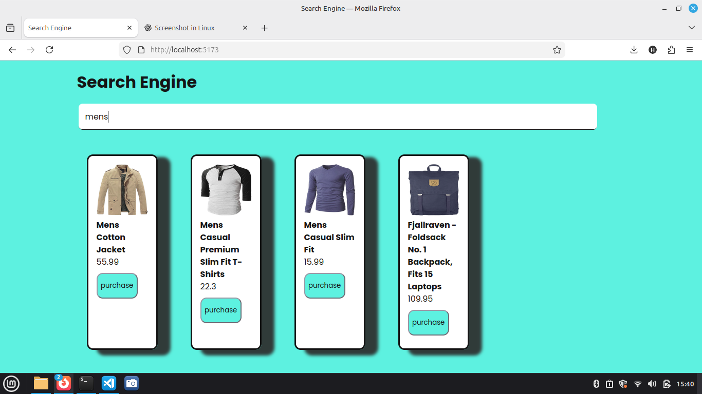
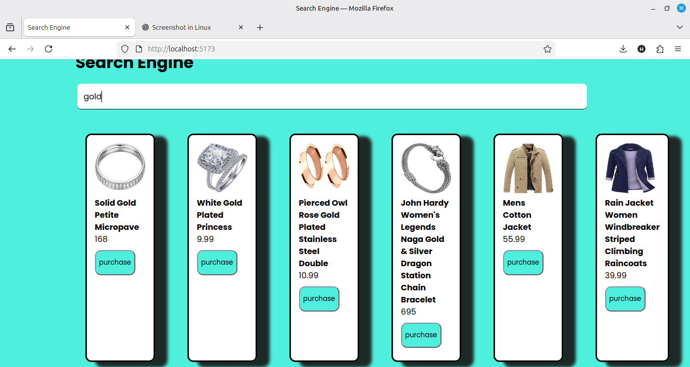
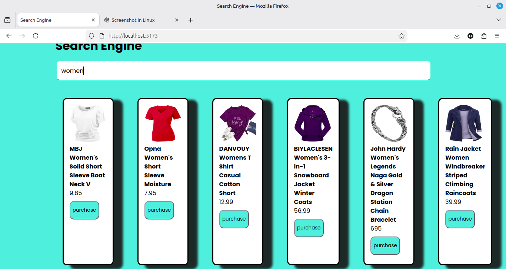

# 🔍 Search Engine Project (Algolia)

A web-based search engine application built using **HTML, CSS, and JavaScript**, integrated with **Algolia Search API** to provide fast and accurate real-time search results from structured data.

This project focuses on performance, clean UI, and secure API usage, making it suitable for learning, portfolio, and frontend interviews.

---

## 📌 Project Overview
The Search Engine project allows users to quickly search through indexed data using Algolia.  
It demonstrates how modern search engines work with client-side JavaScript and third-party APIs.

---

## 🚀 Features
- 🔎 Real-time search results using Algolia
- ⚡ Fast and optimized search performance
- 📄 JSON-based searchable data
- 🔐 Secure usage of search-only API key
- 📱 Responsive and clean UI
- 🔑 Login page interface
- 🧩 Well-structured project files

---

## 🛠️ Technologies Used
- HTML5
- CSS3
- JavaScript (ES6)
- Algolia Search API
- Node.js & npm

---

## 📂 Project Structure
```

├── dist/                # Build files
├── data.json            # Search data source
├── index.html           # Main search page
├── login.html           # Login page UI
├── main.js              # Search logic & Algolia integration
├── package.json         # Project dependencies
├── package-lock.json    # Dependency lock file

````

---

## ⚙️ How It Works
1. Data is stored in `data.json`
2. Data is indexed in Algolia
3. User enters a query in the search input
4. Algolia processes the query
5. Matching results are returned instantly
6. Results are displayed dynamically on the UI

---

## ⚙️ Setup & Installation
1. Clone the repository:
```bash
git clone https://github.com/harika655/searchengine.git
````

2. Navigate to the project folder:

```bash
cd searchengine
```

3. Install dependencies:

```bash
npm install
```

4. Open `index.html` in your browser
   (or use Live Server)

---

## 🔐 Security Notes

* Uses **Algolia Search-only API key**
* Admin API keys are **not exposed**
* `.env` and `node_modules` are excluded using `.gitignore`

---

## 📸 Screenshots

### 🔍 Search Page


### 🔑 Results Page






---

## 🌐 Live Demo

https://algolia-search-engine.netlify.app/
https://harika655.github.io/searchengine/

---

## 👩‍💻 Author

**Harika T**
Frontend Developer
GitHub: [https://github.com/harika655](https://github.com/harika655)
Linkdin: (www.linkedin.com/in/harika-t-b1731b222)

---

## 📄 Purpose

This project is created for **learning, practice, and portfolio showcase**.

```
